# PyPRS: Python Implementation for Partition-based Random Search

[TOC]

## Introduction

This repository contains the implementation of the framework to solve stochastic multi-objective optimization via simulation (MOvS) presented in the working paper entitled "*A **P**artition-based **R**andom **S**earch for Multi-objective Optimization via Simulation*". In this research, we consider multi-objective problems over discrete solution space, where noise-corrupted observations of the objective measures are evaluated via stochastic simulation. We call them multi-objective optimization via simulation. These problems are widely seen in the real world and can be extremely hard to solve due to the lack of rich structure of the search space and noisy measurements. To address these issues, we propose two algorithms using the partition-based random search method, called MPRS-C for the constrained case and MPRS-U for the unconstrained case respectively. MPRS-C selects several most promising regions (MPR) in each iteration based on the local and global random search results and partitions them systematically into sub-regions which are further sampled to update MPR. MPRS-U utilizes the idea of breadth-first search, and the search space is expanded from an initial hyperrectangle to its neighbor hyperrectangles iteratively. To further improve the search efficiency, simulation allocation rules can be incorporated to reduce the influence of observation noise for the two algorithms. The proposed algorithms are proven to converge to the global Pareto set with probability one for both constrained and unconstrained cases. Numerical experiments are conducted to demonstrate the effectiveness and robustness of the proposed algorithms compared to other benchmarks (e.g., VEGA, SPEA2, NSGA-II, NSPSO and SMS-EMOA).

### Demo of MPRS-C

Below is an illustration that shows how MPRS-C can converge to the global Pareto set of two-dimensional deterministic ZDT1 and FON test problems with discrete level 100 and maximum simulation budget 2000. For the definition of the three performance metrics (i.e., hypervolume, true Pareto proportion, and hausdorff distance), please refer to our working paper. 

#### Test Problem: ZDT1


#### Test Problem: FON


### Basic Idea of MPRS-C: Constrained MOvS

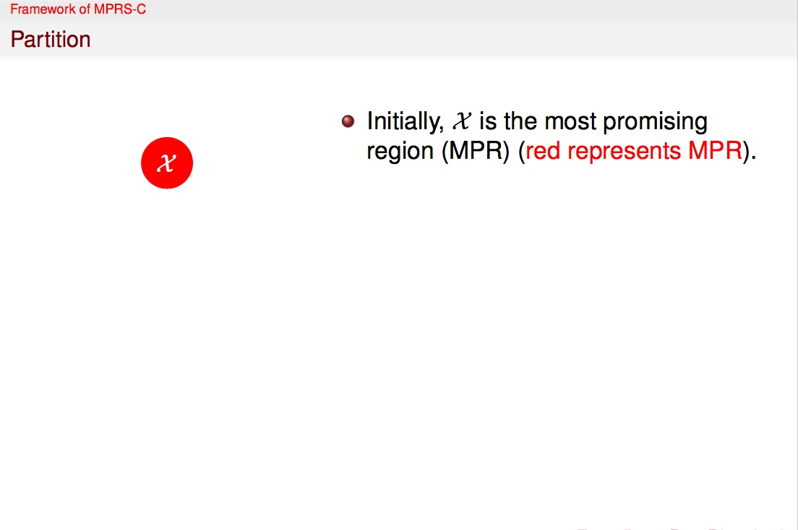


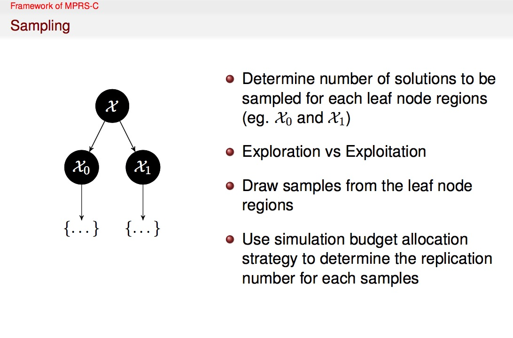
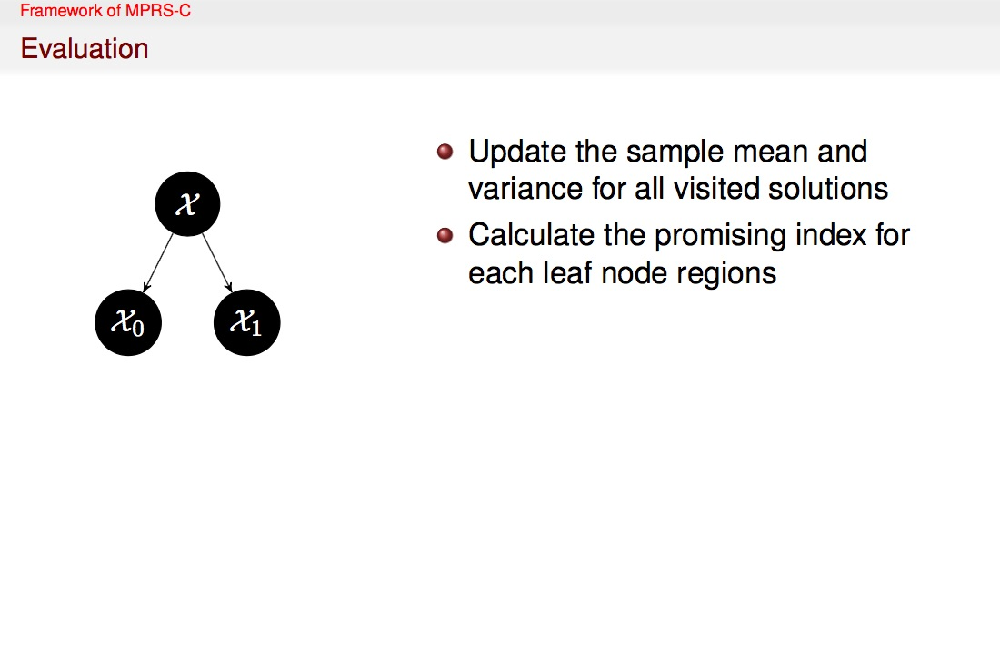
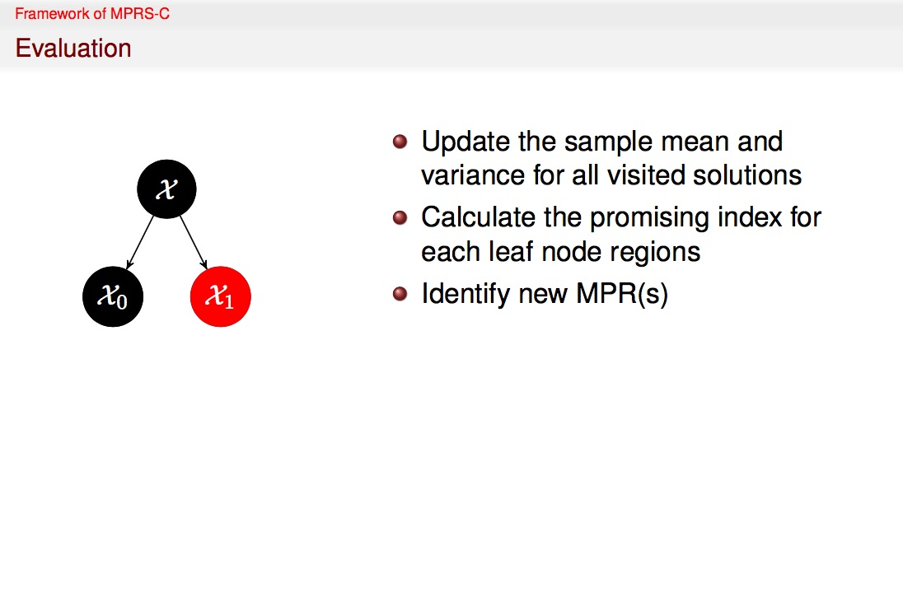
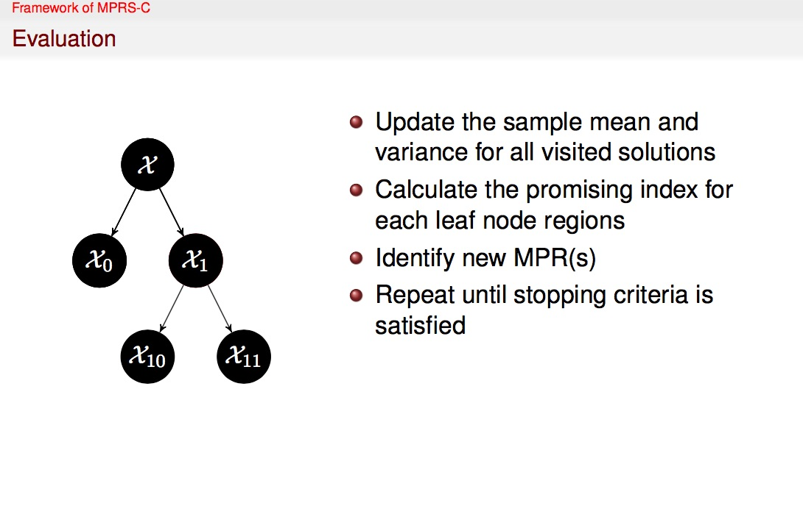
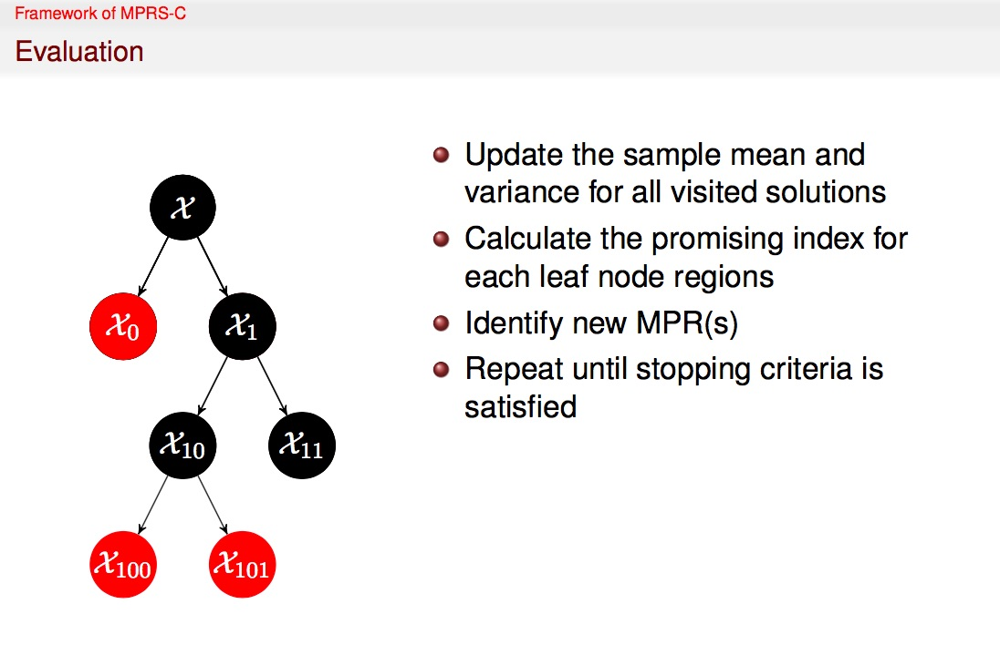

### Basic Idea of MPRS-U: Unconstrained MOvS

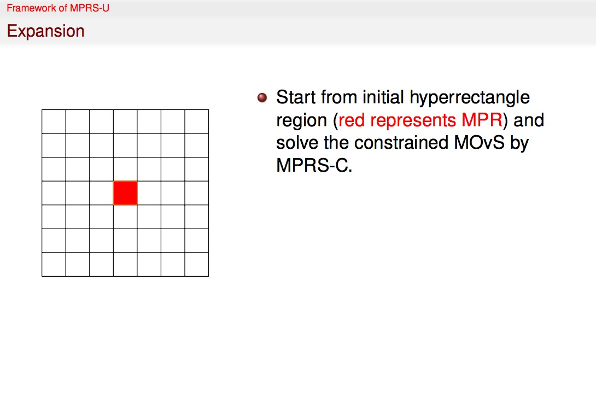
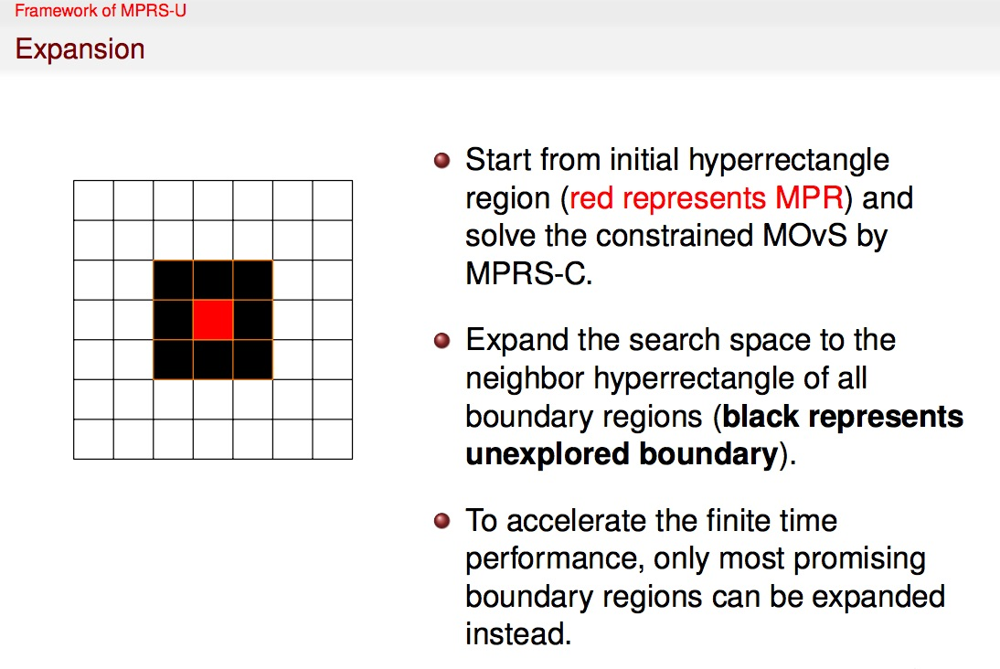
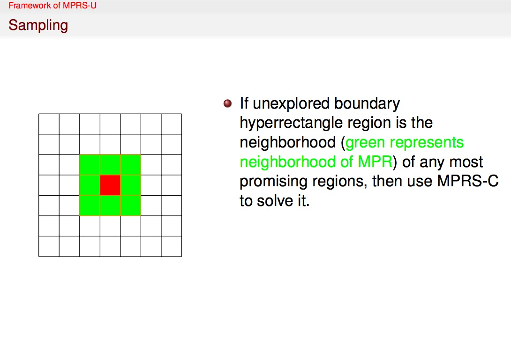
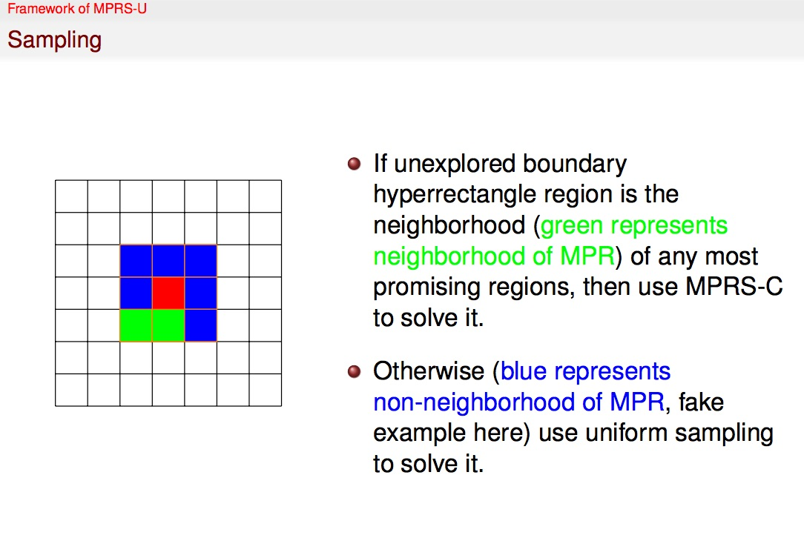
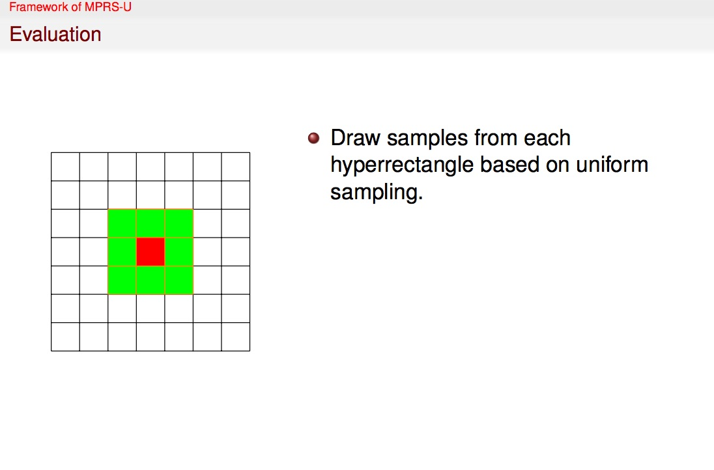
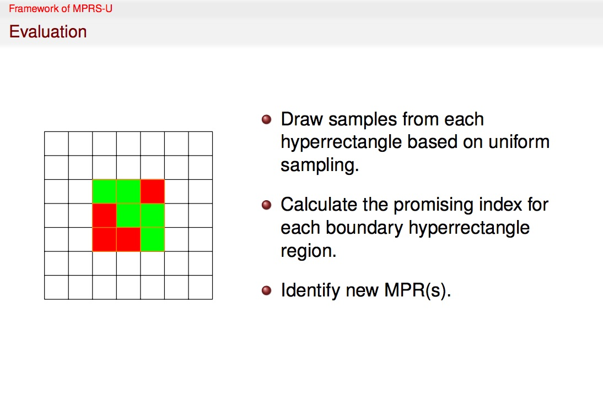
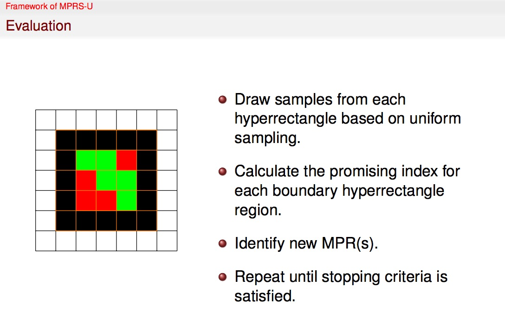
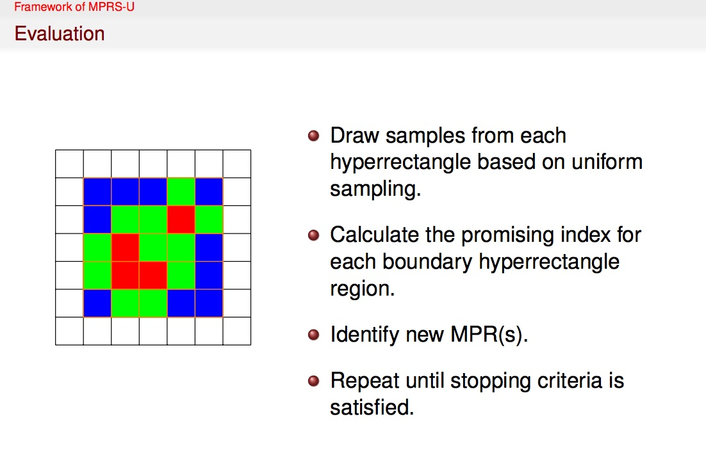
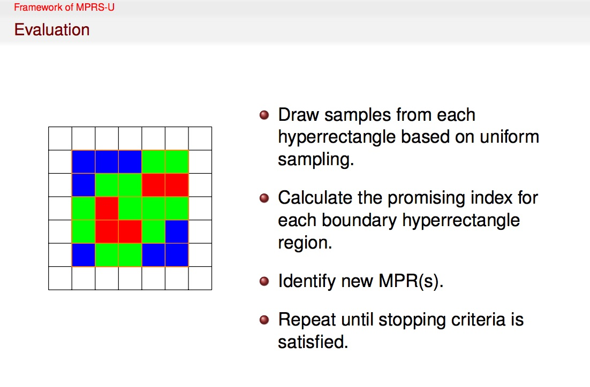
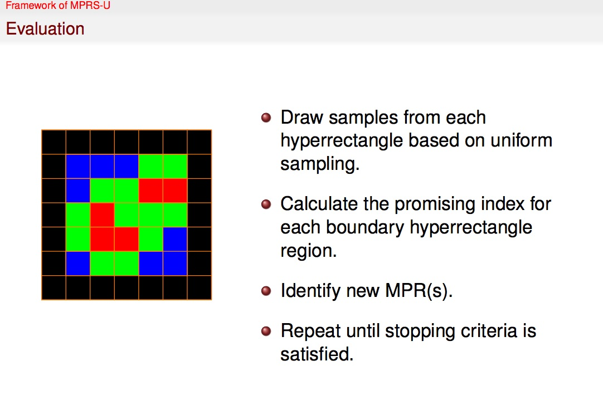

## Tutorial

### How to define the optimization problem?

```python
import PyPRS as prs
import numpy as np

def zdt1(num,isStochastic,std=1,dim=2,referencePoint = np.array([]), discreteLevel = 0):
    """ the optimal solution of zdt1 test problem is {x1=[0,1], xi=0}
    Args:
    	num: An integer representing the size of the meshgrid (for the 2D contour plot)
    	isStochastic: A Boolean representing whether the problem is stochastic
    	std: A double representing the standard deviation of the noise in the objectives evaluation
    	dim: An integer representing the dimension of the problem's solution space
    	referencePoint: A numpy array representing random selected reference point
    	discreteLevel: An integer indicating the discrete level (0 means continuous)
    Returns:
    	problem: A PyPRS.Problem() instance of ZDT1 test problem
    """
    # define the solution space
    lb = np.array([0.0,]*dim)
    ub = np.array([1.0,]*dim)
    # define the multi-objectives
    zdt1g = lambda x: 1 + 9*np.mean(x[1:])
    zdt11 = lambda x: x[0]
    zdt12 = lambda x: zdt1g(x) * (1 - np.sqrt(x[0]/zdt1g(x)))
    objectives = [zdt11,zdt12]   
    # construct the optimal solutions (i.e. Pareto set for multi-objective optimization)
    if discreteLevel != 0:
        trueParetoSet = np.array([[x1]+[0]*(dim-1) for x1 in np.linspace(0,1,discreteLevel+1)])
    else:
        trueParetoSet = np.array([[x1]+[0]*(dim-1) for x1 in np.linspace(0.05,0.95,1000)])
    # use PyPRS.Problem() to create the instance of the optimization problem
    problemArgs = {
        'description':'ZDT1',
        'lb':lb,
        'ub':ub,
        'objectives':objectives,
        'num': num,
        'stochastic': isStochastic,
        'std': std,
        'referencePoint': referencePoint,
        'trueParetoSet': trueParetoSet,
        'dim': dim,
        'discreteLevel': discreteLevel,                        
    }
    problem = prs.Problem()
    problem.init(problemArgs)
    return problem     
```

### How to define the Partition-based Random Search algorithm?

The MPRS-C framework contains three major components including partitioning, sampling, and evaluation. You can customize your own instance of the MPRS-C framwork by combining various partitioning (e.g., bisection method, machine learning classifiers), sampling (e.g., uniform sampling, coordinate sampling) and evaluation methods. We implemented some preliminary methods in the directory "PyPRS/rule". Basically speaking, the users can alternate different implementations of the following components.

- partition.py: determine how the most promising regions are partitioned into sub-regions
- pi.py: define the promising index measure function to evaluate the poential of each region containing the Pareto solutions
- replicationSize.py: determine the replication size for each solution to be sampled to reduce the noise
- sampleMethod.py: determine how the solutions are drawn from the feasible space
- sampleSize.py: determine how many solutions to draw from each region
- si.py: define the sampling index measure function which might be used to calculate the sample size for each region
- stop.py: determine when the algorithm should stop

```python
import PyPRS as prs

def moprs(deltaSampleSize=30, unitSampleSize=5,
          stop=prs.rule.stop.exceedMaximumSampleSize,
          stopArgs={},
          sampleMethod=prs.rule.sampleMethod.uniform,
          sampleMethodArgs={},
          sampleSize=prs.rule.sampleSize.samplingIndex,
          si=prs.rule.si.equal,
          si_ucb_c=0.5,
          pi=prs.rule.pi.minimumDominationCount,
          alphaPI=0,
          partition=prs.rule.partition.bisection,atomPartitionScale=0,
          replicationSize=prs.rule.replicationSize.equal,
          unitReplicationSize=5,replicationTimes=5,
          partitionArgs={},
          animationOn=True):
    """
    Args:
    	deltaSampleSize: An integer representing the sample budget for each iteration
    	unitSampleSize: An integer representing the sample budget for each region in each iteration
    	stopArgs: A dictionary representing the necessary arguments for the stop rule
    	sampleMethod: A function determining the sampling method
    	sampleSize: A function determining the sampling size for each region
    	si: A function determing the sampling index
    	si_ucb_c: A double that might be used to calculate the sampling index
    	pi: A function determining the promising index
    	alphaPI: A double incidating the percentile to determine promising index
    	partition: A function determing how the most promising regions are partitioned
    	atomPartitionScale: A double indicating the smallest scale of atom leaf node region
    	replicationSize: A function determing the replication size for each solution to be sampled
    	unitReplicationSize: An integer that might be used to decide the replication size
    	replicationTimes: An integer that might be used to decide the replication size
    	partitionArgs: A dictionary representing the necessary arguments for the partition rule
    	animationOn: A Boolean indicating whether to generate the animiaiton showing the convergence of the algorithm in each iteration (only valid for the problem with 2-dimensional solution space)
    Returns:
    	algo: A PyPRS.Core() instance
    """
    #define rules
    ruleArgs = {
            'description' : 'Default Rule',
            'stop' : stop,
            'partition' : partition,
            'sampleSize' : sampleSize,
            'replicationSize' : replicationSize,
            'sampleMethod' : sampleMethod,
            'sampleMethodArgs': sampleMethodArgs,
            'pi' : pi,
            'si' : si,
            'siArgs': {'ucb_c':si_ucb_c},
            'stopArgs':stopArgs,
            'sampleSizeArgs' : {'deltaSampleSize': deltaSampleSize,
                                'unitSampleSize': unitSampleSize},
            'replicationSizeArgs' : {'unitReplicationSize':unitReplicationSize,
                                     'replicationTimes':replicationTimes,
                                     'paretoReplicationSize':unitReplicationSize,
                                     'minimumStd':0.1},
            'alphaPI': alphaPI,
            'atomPartitionScale': atomPartitionScale,
            'partitionArgs': partitionArgs,
            'animationOn': animationOn,
        }
    r = RuleSet()
    r.init(ruleArgs)
    #new search tree
    tree = Tree()
    #define PRS algorithms
    algoArgs = {'description':'Default MO-PRS','rule':r,'tree':tree,}
    algo = Core()
    algo.init(algoArgs)  
    return algo
```

### How to run and compare the algorithms?

Please check the PyPRS.Race() class which supports the replication-runs for the algorithm and can output the convergence results.

### How to visualize the convergence of the algorithms?

Please check the PyPRS.visualize module which supports a large number of visualization methods.

### More random search algorithms for the Multi-objective optimization

Please check [PyGMO](http://esa.github.io/pygmo/) (the Python Parallel Global Multiobjective Optimizer) which is a scientific library providing a large number of optimisation problems and algorithms under the same powerful parallelization abstraction built around the *generalized island-model* paradigm.

### Example Codes

In the directory "example/ieee tevc", we provided several examples, which compare the convergence performance of our framework to the well-known benchmarks (e.g., VEGA, SPEA2, NSGA-II, NSPSO and SMS-EMOA) for both deterministic and stochastic case, used in our working paper. 